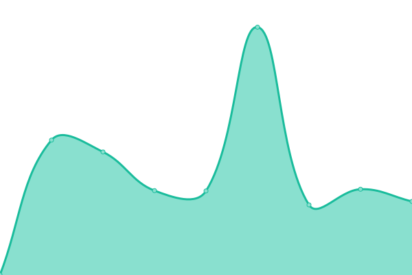

# [📈 Live Status](https://demo.upptime.js.org): <!--live status--> **🟩 All systems operational**

This repository contains the open-source uptime monitor and status page for [Upptime](https://upptime.js.org), powered by [Upptime](https://github.com/upptime/upptime).

With [Upptime](https://upptime.js.org), you can get your own unlimited and free uptime monitor and status page, powered entirely by a GitHub repository. We use [Issues](https://github.com/upptime/upptime/issues) as incident reports, [Actions](https://github.com/AlonsoK28/amzmation-upptime/actions) as uptime monitors, and [Pages](https://demo.upptime.js.org) for the status page.

<!--start: status pages-->
<!-- This summary is generated by Upptime (https://github.com/upptime/upptime) -->
<!-- Do not edit this manually, your changes will be overwritten -->
<!-- prettier-ignore -->
| URL | Status | History | Response Time | Uptime |
| --- | ------ | ------- | ------------- | ------ |
|  [Conexión remota con su base de datos Empresarial](https://la-bodega-china-verificador-precios.com/api/search-by-codebar-la-bodega-china/M1058-1F-3) | 🟩 Up | [conexion-remota-con-su-base-de-datos-empresarial.yml](https://github.com/verificador-precios/la-bodega-china-upptime-2/commits/HEAD/history/conexion-remota-con-su-base-de-datos-empresarial.yml) | 

 1348ms
     
 | 

<a href="https://verificador-precios.github.io/la-bodega-china-upptime-2/history/conexion-remota-con-su-base-de-datos-empresarial">99.81%</a>
    

<!--end: status pages-->

[**Go to your status website →**](https://verificador-precios.github.io/la-bodega-china-upptime-2/)

## 📄 License

- Powered by: [Upptime](https://github.com/upptime/upptime)
- Code: [MIT](./LICENSE) © [Upptime](https://upptime.js.org)
- Data in the `./history` directory: [Open Database License](https://opendatacommons.org/licenses/odbl/1-0/)
