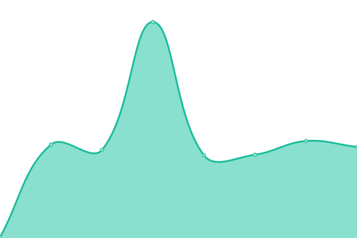
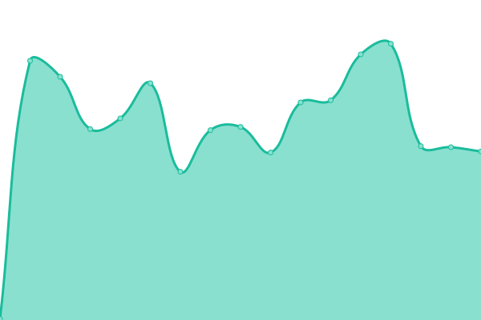
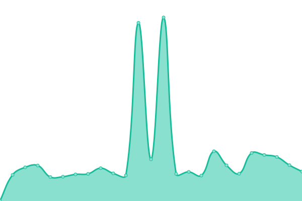
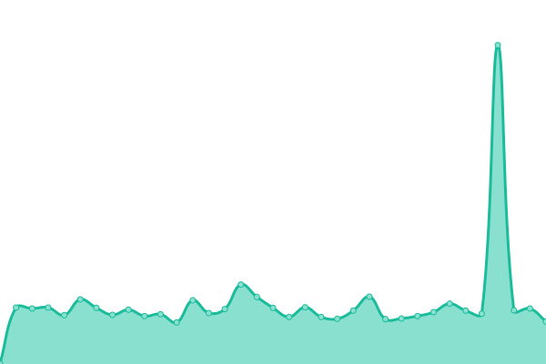
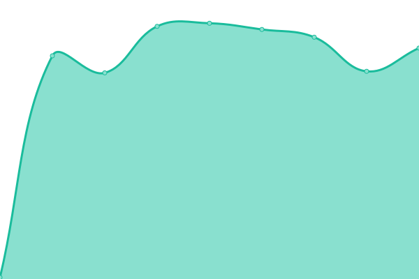

# [📈 Live Status](https://demo.upptime.js.org): <!--live status--> **🟧 Partial outage**

This repository contains the open-source uptime monitor and status page for [Upptime](https://upptime.js.org), powered by [Upptime](https://github.com/upptime/upptime).

With [Upptime](https://upptime.js.org), you can get your own unlimited and free uptime monitor and status page, powered entirely by a GitHub repository. We use [Issues](https://github.com/upptime/upptime/issues) as incident reports, [Actions](https://github.com/AlonsoK28/amzmation-upptime/actions) as uptime monitors, and [Pages](https://demo.upptime.js.org) for the status page.

<!--start: status pages-->
<!-- This summary is generated by Upptime (https://github.com/upptime/upptime) -->
<!-- Do not edit this manually, your changes will be overwritten -->
<!-- prettier-ignore -->
| URL | Status | History | Response Time | Uptime |
| --- | ------ | ------- | ------------- | ------ |
|  [1 - Conexión remota con su base de datos Empresarial (Backend) - Producto M1058-1F-3](https://la-bodega-china-verificador-precios.com/api/search-by-codebar-la-bodega-china/M1058-1F-3) | 🟥 Down | [1-conexion-remota-con-su-base-de-datos-empresarial-backend-producto-m1058-1-f-3.yml](https://github.com/verificador-precios/la-bodega-china-upptime-2/commits/HEAD/history/1-conexion-remota-con-su-base-de-datos-empresarial-backend-producto-m1058-1-f-3.yml) | 

 0ms
     
 | 

<a href="https://verificador-precios.github.io/la-bodega-china-upptime-2/history/1-conexion-remota-con-su-base-de-datos-empresarial-backend-producto-m1058-1-f-3">100.00%</a>
    

|  [2 - Conexión remota con su base de datos Empresarial (Backend) - Producto 2403072340937](https://la-bodega-china-verificador-precios.com/api/search-by-codebar-la-bodega-china/2403072340937) | 🟥 Down | [2-conexion-remota-con-su-base-de-datos-empresarial-backend-producto-2403072340937.yml](https://github.com/verificador-precios/la-bodega-china-upptime-2/commits/HEAD/history/2-conexion-remota-con-su-base-de-datos-empresarial-backend-producto-2403072340937.yml) | 

 0ms
     
 | 

<a href="https://verificador-precios.github.io/la-bodega-china-upptime-2/history/2-conexion-remota-con-su-base-de-datos-empresarial-backend-producto-2403072340937">100.00%</a>
    

|  [3 - Conexión remota con su base de datos Empresarial (Backend) - Producto 2407040425370](https://la-bodega-china-verificador-precios.com/api/search-by-codebar-la-bodega-china/2407040425370) | 🟥 Down | [3-conexion-remota-con-su-base-de-datos-empresarial-backend-producto-2407040425370.yml](https://github.com/verificador-precios/la-bodega-china-upptime-2/commits/HEAD/history/3-conexion-remota-con-su-base-de-datos-empresarial-backend-producto-2407040425370.yml) | 

 0ms
     
 | 

<a href="https://verificador-precios.github.io/la-bodega-china-upptime-2/history/3-conexion-remota-con-su-base-de-datos-empresarial-backend-producto-2407040425370">100.00%</a>
    

|  [4 - Conexión remota con su base de datos Empresarial (Backend) - Producto 2404112348117](https://la-bodega-china-verificador-precios.com/api/search-by-codebar-la-bodega-china/2404112348117) | 🟥 Down | [4-conexion-remota-con-su-base-de-datos-empresarial-backend-producto-2404112348117.yml](https://github.com/verificador-precios/la-bodega-china-upptime-2/commits/HEAD/history/4-conexion-remota-con-su-base-de-datos-empresarial-backend-producto-2404112348117.yml) | 

 0ms
     
 | 

<a href="https://verificador-precios.github.io/la-bodega-china-upptime-2/history/4-conexion-remota-con-su-base-de-datos-empresarial-backend-producto-2404112348117">100.00%</a>
    

|  [5 - Conexión remota con su base de datos Empresarial (Backend) - Producto 2404112353067](https://la-bodega-china-verificador-precios.com/api/search-by-codebar-la-bodega-china/2404112353067) | 🟥 Down | [5-conexion-remota-con-su-base-de-datos-empresarial-backend-producto-2404112353067.yml](https://github.com/verificador-precios/la-bodega-china-upptime-2/commits/HEAD/history/5-conexion-remota-con-su-base-de-datos-empresarial-backend-producto-2404112353067.yml) | 

 0ms
     
 | 

<a href="https://verificador-precios.github.io/la-bodega-china-upptime-2/history/5-conexion-remota-con-su-base-de-datos-empresarial-backend-producto-2404112353067">100.00%</a>
    

|  [6 - Conexión remota con su base de datos Empresarial (Backend) - Producto M138-37F-81](https://la-bodega-china-verificador-precios.com/api/search-by-codebar-la-bodega-china/M138-37F-81) | 🟥 Down | [6-conexion-remota-con-su-base-de-datos-empresarial-backend-producto-m138-37-f-81.yml](https://github.com/verificador-precios/la-bodega-china-upptime-2/commits/HEAD/history/6-conexion-remota-con-su-base-de-datos-empresarial-backend-producto-m138-37-f-81.yml) | 

 0ms
     
 | 

<a href="https://verificador-precios.github.io/la-bodega-china-upptime-2/history/6-conexion-remota-con-su-base-de-datos-empresarial-backend-producto-m138-37-f-81">100.00%</a>
    

|  [7 - Conexión remota con su base de datos Empresarial (Backend) - Producto 2404050110333](https://la-bodega-china-verificador-precios.com/api/search-by-codebar-la-bodega-china/2404050110333) | 🟥 Down | [7-conexion-remota-con-su-base-de-datos-empresarial-backend-producto-2404050110333.yml](https://github.com/verificador-precios/la-bodega-china-upptime-2/commits/HEAD/history/7-conexion-remota-con-su-base-de-datos-empresarial-backend-producto-2404050110333.yml) | 

 0ms
     
 | 

<a href="https://verificador-precios.github.io/la-bodega-china-upptime-2/history/7-conexion-remota-con-su-base-de-datos-empresarial-backend-producto-2404050110333">100.00%</a>
    

|  [8 - Conexión remota con su base de datos Empresarial (Backend) - Producto 2403042351520](https://la-bodega-china-verificador-precios.com/api/search-by-codebar-la-bodega-china/2403042351520) | 🟥 Down | [8-conexion-remota-con-su-base-de-datos-empresarial-backend-producto-2403042351520.yml](https://github.com/verificador-precios/la-bodega-china-upptime-2/commits/HEAD/history/8-conexion-remota-con-su-base-de-datos-empresarial-backend-producto-2403042351520.yml) | 

 0ms
     
 | 

<a href="https://verificador-precios.github.io/la-bodega-china-upptime-2/history/8-conexion-remota-con-su-base-de-datos-empresarial-backend-producto-2403042351520">100.00%</a>
    

|  [9 - Conexión remota con su base de datos Empresarial (Backend) - Producto M371-2H-15](https://la-bodega-china-verificador-precios.com/api/search-by-codebar-la-bodega-china/M371-2H-15) | 🟥 Down | [9-conexion-remota-con-su-base-de-datos-empresarial-backend-producto-m371-2-h-15.yml](https://github.com/verificador-precios/la-bodega-china-upptime-2/commits/HEAD/history/9-conexion-remota-con-su-base-de-datos-empresarial-backend-producto-m371-2-h-15.yml) | 

 0ms
     
 | 

<a href="https://verificador-precios.github.io/la-bodega-china-upptime-2/history/9-conexion-remota-con-su-base-de-datos-empresarial-backend-producto-m371-2-h-15">100.00%</a>
    

|  [10 - Conexión remota con su base de datos Empresarial (Backend) - Producto M185-5H-1](https://la-bodega-china-verificador-precios.com/api/search-by-codebar-la-bodega-china/M185-5H-1) | 🟥 Down | [10-conexion-remota-con-su-base-de-datos-empresarial-backend-producto-m185-5-h-1.yml](https://github.com/verificador-precios/la-bodega-china-upptime-2/commits/HEAD/history/10-conexion-remota-con-su-base-de-datos-empresarial-backend-producto-m185-5-h-1.yml) | 

 0ms
     
 | 

<a href="https://verificador-precios.github.io/la-bodega-china-upptime-2/history/10-conexion-remota-con-su-base-de-datos-empresarial-backend-producto-m185-5-h-1">100.00%</a>
    

|  [11 - Conexión remota con su base de datos Empresarial (Backend) - Producto M134-29H-26](https://la-bodega-china-verificador-precios.com/api/search-by-codebar-la-bodega-china/M134-29H-26) | 🟥 Down | [11-conexion-remota-con-su-base-de-datos-empresarial-backend-producto-m134-29-h-26.yml](https://github.com/verificador-precios/la-bodega-china-upptime-2/commits/HEAD/history/11-conexion-remota-con-su-base-de-datos-empresarial-backend-producto-m134-29-h-26.yml) | 

 0ms
     
 | 

<a href="https://verificador-precios.github.io/la-bodega-china-upptime-2/history/11-conexion-remota-con-su-base-de-datos-empresarial-backend-producto-m134-29-h-26">100.00%</a>
    

|  [Software de Verificador de Precios (Frontend)](https://la-bodega-china-verificador-precios-frontend.com/) | 🟩 Up | [software-de-verificador-de-precios-frontend.yml](https://github.com/verificador-precios/la-bodega-china-upptime-2/commits/HEAD/history/software-de-verificador-de-precios-frontend.yml) | 

 145ms
     
 | 

<a href="https://verificador-precios.github.io/la-bodega-china-upptime-2/history/software-de-verificador-de-precios-frontend">100.00%</a>
    

<!--end: status pages-->

[**Go to your status website →**](https://verificador-precios.github.io/la-bodega-china-upptime-2/)

## 📄 License

- Powered by: [Upptime](https://github.com/upptime/upptime)
- Code: [MIT](./LICENSE) © [Upptime](https://upptime.js.org)
- Data in the `./history` directory: [Open Database License](https://opendatacommons.org/licenses/odbl/1-0/)
