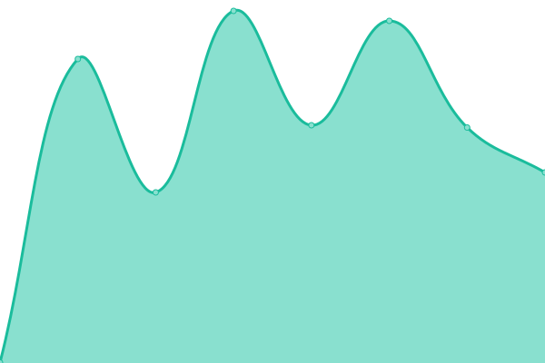

# [📈 Live Status](https://demo.upptime.js.org): <!--live status--> **🟩 All systems operational**

This repository contains the open-source uptime monitor and status page for [Upptime](https://upptime.js.org), powered by [Upptime](https://github.com/upptime/upptime).

With [Upptime](https://upptime.js.org), you can get your own unlimited and free uptime monitor and status page, powered entirely by a GitHub repository. We use [Issues](https://github.com/upptime/upptime/issues) as incident reports, [Actions](https://github.com/AlonsoK28/amzmation-upptime/actions) as uptime monitors, and [Pages](https://demo.upptime.js.org) for the status page.

<!--start: status pages-->
<!-- This summary is generated by Upptime (https://github.com/upptime/upptime) -->
<!-- Do not edit this manually, your changes will be overwritten -->
<!-- prettier-ignore -->
| URL | Status | History | Response Time | Uptime |
| --- | ------ | ------- | ------------- | ------ |
|  [Conexión remota con su base de datos Empresarial (Backend) - Producto 1](https://la-bodega-china-verificador-precios.com/api/search-by-codebar-la-bodega-china/M1058-1F-3) | 🟩 Up | [conexion-remota-con-su-base-de-datos-empresarial-backend-producto-1.yml](https://github.com/verificador-precios/la-bodega-china-upptime-2/commits/HEAD/history/conexion-remota-con-su-base-de-datos-empresarial-backend-producto-1.yml) | 

 595ms
     
 | 

<a href="https://verificador-precios.github.io/la-bodega-china-upptime-2/history/conexion-remota-con-su-base-de-datos-empresarial-backend-producto-1">100.00%</a>
    

|  [Conexión remota con su base de datos Empresarial (Backend) - Producto 2](https://la-bodega-china-verificador-precios.com/api/search-by-codebar-la-bodega-china/2403072340937) | 🟩 Up | [conexion-remota-con-su-base-de-datos-empresarial-backend-producto-2.yml](https://github.com/verificador-precios/la-bodega-china-upptime-2/commits/HEAD/history/conexion-remota-con-su-base-de-datos-empresarial-backend-producto-2.yml) | 

 156ms
     
 | 

<a href="https://verificador-precios.github.io/la-bodega-china-upptime-2/history/conexion-remota-con-su-base-de-datos-empresarial-backend-producto-2">100.00%</a>
    

|  [Conexión remota con su base de datos Empresarial (Backend) - Producto 3](https://la-bodega-china-verificador-precios.com/api/search-by-codebar-la-bodega-china/2407040425370) | 🟩 Up | [conexion-remota-con-su-base-de-datos-empresarial-backend-producto-3.yml](https://github.com/verificador-precios/la-bodega-china-upptime-2/commits/HEAD/history/conexion-remota-con-su-base-de-datos-empresarial-backend-producto-3.yml) | 

 158ms
     
 | 

<a href="https://verificador-precios.github.io/la-bodega-china-upptime-2/history/conexion-remota-con-su-base-de-datos-empresarial-backend-producto-3">100.00%</a>
    

|  [Conexión remota con su base de datos Empresarial (Backend) - Producto 4](https://la-bodega-china-verificador-precios.com/api/search-by-codebar-la-bodega-china/2404112348117) | 🟩 Up | [conexion-remota-con-su-base-de-datos-empresarial-backend-producto-4.yml](https://github.com/verificador-precios/la-bodega-china-upptime-2/commits/HEAD/history/conexion-remota-con-su-base-de-datos-empresarial-backend-producto-4.yml) | 

 156ms
     
 | 

<a href="https://verificador-precios.github.io/la-bodega-china-upptime-2/history/conexion-remota-con-su-base-de-datos-empresarial-backend-producto-4">100.00%</a>
    

|  [Conexión remota con su base de datos Empresarial (Backend) - Producto 5](https://la-bodega-china-verificador-precios.com/api/search-by-codebar-la-bodega-china/2404112353067) | 🟩 Up | [conexion-remota-con-su-base-de-datos-empresarial-backend-producto-5.yml](https://github.com/verificador-precios/la-bodega-china-upptime-2/commits/HEAD/history/conexion-remota-con-su-base-de-datos-empresarial-backend-producto-5.yml) | 

 155ms
     
 | 

<a href="https://verificador-precios.github.io/la-bodega-china-upptime-2/history/conexion-remota-con-su-base-de-datos-empresarial-backend-producto-5">100.00%</a>
    

|  [Conexión remota con su base de datos Empresarial (Backend) - Producto 6](https://la-bodega-china-verificador-precios.com/api/search-by-codebar-la-bodega-china/M138-37F-81) | 🟩 Up | [conexion-remota-con-su-base-de-datos-empresarial-backend-producto-6.yml](https://github.com/verificador-precios/la-bodega-china-upptime-2/commits/HEAD/history/conexion-remota-con-su-base-de-datos-empresarial-backend-producto-6.yml) | 

 158ms
     
 | 

<a href="https://verificador-precios.github.io/la-bodega-china-upptime-2/history/conexion-remota-con-su-base-de-datos-empresarial-backend-producto-6">100.00%</a>
    

|  [Conexión remota con su base de datos Empresarial (Backend) - Producto 7](https://la-bodega-china-verificador-precios.com/api/search-by-codebar-la-bodega-china/2404050110333) | 🟩 Up | [conexion-remota-con-su-base-de-datos-empresarial-backend-producto-7.yml](https://github.com/verificador-precios/la-bodega-china-upptime-2/commits/HEAD/history/conexion-remota-con-su-base-de-datos-empresarial-backend-producto-7.yml) | 

 159ms
     
 | 

<a href="https://verificador-precios.github.io/la-bodega-china-upptime-2/history/conexion-remota-con-su-base-de-datos-empresarial-backend-producto-7">100.00%</a>
    

|  [Conexión remota con su base de datos Empresarial (Backend) - Producto 8](https://la-bodega-china-verificador-precios.com/api/search-by-codebar-la-bodega-china/2403042351520) | 🟩 Up | [conexion-remota-con-su-base-de-datos-empresarial-backend-producto-8.yml](https://github.com/verificador-precios/la-bodega-china-upptime-2/commits/HEAD/history/conexion-remota-con-su-base-de-datos-empresarial-backend-producto-8.yml) | 

 158ms
     
 | 

<a href="https://verificador-precios.github.io/la-bodega-china-upptime-2/history/conexion-remota-con-su-base-de-datos-empresarial-backend-producto-8">100.00%</a>
    

|  [Conexión remota con su base de datos Empresarial (Backend) - Producto 9](https://la-bodega-china-verificador-precios.com/api/search-by-codebar-la-bodega-china/M371-2H-15) | 🟩 Up | [conexion-remota-con-su-base-de-datos-empresarial-backend-producto-9.yml](https://github.com/verificador-precios/la-bodega-china-upptime-2/commits/HEAD/history/conexion-remota-con-su-base-de-datos-empresarial-backend-producto-9.yml) | 

 156ms
     
 | 

<a href="https://verificador-precios.github.io/la-bodega-china-upptime-2/history/conexion-remota-con-su-base-de-datos-empresarial-backend-producto-9">100.00%</a>
    

|  [Software de Verificador de Precios (Frontend)](https://la-bodega-china-verificador-precios-frontend.com/) | 🟩 Up | [software-de-verificador-de-precios-frontend.yml](https://github.com/verificador-precios/la-bodega-china-upptime-2/commits/HEAD/history/software-de-verificador-de-precios-frontend.yml) | 

 132ms
     
 | 

<a href="https://verificador-precios.github.io/la-bodega-china-upptime-2/history/software-de-verificador-de-precios-frontend">100.00%</a>
    

<!--end: status pages-->

[**Go to your status website →**](https://verificador-precios.github.io/la-bodega-china-upptime-2/)

## 📄 License

- Powered by: [Upptime](https://github.com/upptime/upptime)
- Code: [MIT](./LICENSE) © [Upptime](https://upptime.js.org)
- Data in the `./history` directory: [Open Database License](https://opendatacommons.org/licenses/odbl/1-0/)
